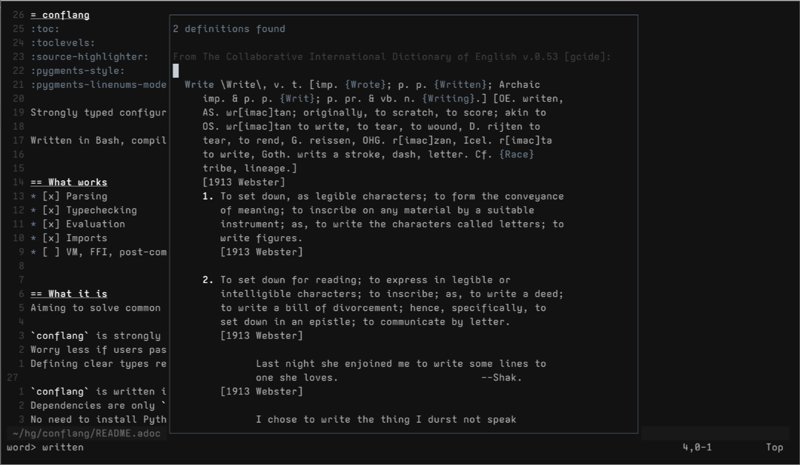

# dictd.nvim
View dictionary definitions in a convenient floating window.

Dependencies:
- [dictd](https://wiki.archlinux.org/title/Dictd)
- Systems supporting `io.popen()`

# Usage
Use a mapped keybind to prompt for a word.
E.g., `<leader>df`.

Hover a word and press `K`.
Dictionary definition appears in a floating window.
Press `q`, or `:q` to close the window.



# Setup
1. Install the plugin
2. Set a keymap
3. (Optionally) set filetypes to overwrite the `keywordprg` with `:Dict`

## Native
Don't copy/paste.
Read & understand what's happening.
Modify as needed.

```bash
PLUGIN_DIR=~/.local/share/nvim/site/pack/plugins/start/
mkdir -p "$PLUGIN_DIR"

git clone 'https://git.sr.ht/~carlinigraphy/dictd.nvim' "$PLUGIN_DIR"

cat <<EOF >> ~/.config/nvim/init.lua
require("dictd").configure({
    keymap = '<leader>df',              #< required
    filetypes = { 'text', 'markdown' }  #< optional
})
EOF
```

The `configure()` function creates a user command, autocmd, and keymap.
It is possible to use `dictd` without it:

_init.lua_
```lua
vim.keymap.set("n", "<leader>df", function()
    local term = vim.fn.input({
        prompt = "word> ",
        default = vim.fn.expand("<cword>"),
    })
    require("dictd").lookup(term)
end)
```

## Lazy
```lua
{
    "https://git.sr.ht/~carlinigraphy/dictd.nvim",
    config = function()
        require("dictd").configure({
            keymap = '<leader>df',              --< required
            filetypes = { 'text', 'markdown' }  --< optional
        })
    end
}
```

# Security
Definitions are found by slamming an `io.popen("dictd " .. term)`.
This means you CAN shell injection yourself.
But why would you do that?

I'm not sure why Lua's `io.popen` doesn't take a command & table of arguments.
Just... don't try to look up `; rm -rf /`.
